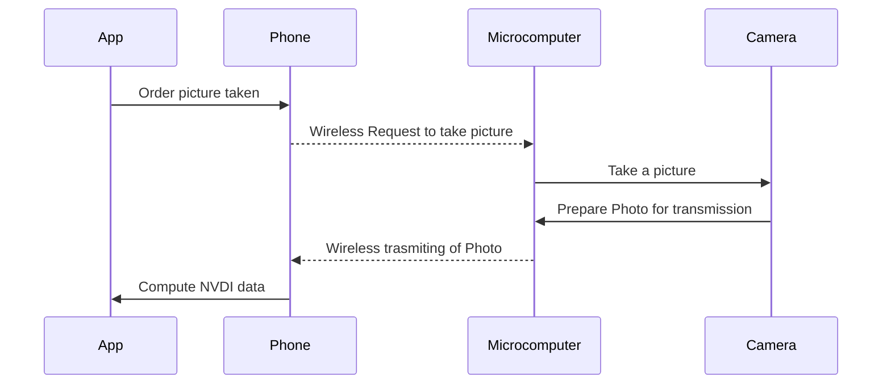

# Eye-In-The-Sky
NDVI analysis mobile app
# Eye In The Sky

The purpose of this project is to create a mobile app that is capable of receiving a wireless camera's input, taking pictures using said camera and doing NVDI calculations, if the camera has infrared capabilities

## How it works
There are two segments to this project the Mobile App and the Camera/Microcomputer

### Mobile App
The idea is to create an independent mobile app, capable of receiving pictures from a wireless source and also doing all of the calculations for NVDI.

### The Camera / Microcomputer
The purpose of this device is to physically take a photo and transmit the data to the mobile app. To start this device will most likely be a Raspberry Pi, with the intention to expand upon what can be used to wirelessly send out data.

> We want to get this into a lot of people's hands so there is a focus on compatibility, the app will eventually be camera agnostic, meaning we want any signal, we don't care what device it is from, as long as it has infrared data.

>This is the eventual form above, to start we may not have the ability for the app to request pictures, it may be on a timer
>The choice to have all calculations done on the App is due to the ease of iterating on a mobile application vs. the editing of individual Raspberry Pis, this design also allows us to use anything that can send out photos rather than just Microcomputers

# What we want to achieve 
A mobile app that can be used on Android or IOS, that can operate independently of the camera. We want people to be able to piecemeal this project together on their own i.e. use an old wireless camera, and their current phone, without needing to do any complex camera/ microcomputer editing.
The best case would be the ability for anyone to be able to grab the data of their environment or city, for projects, research, or art.
 
